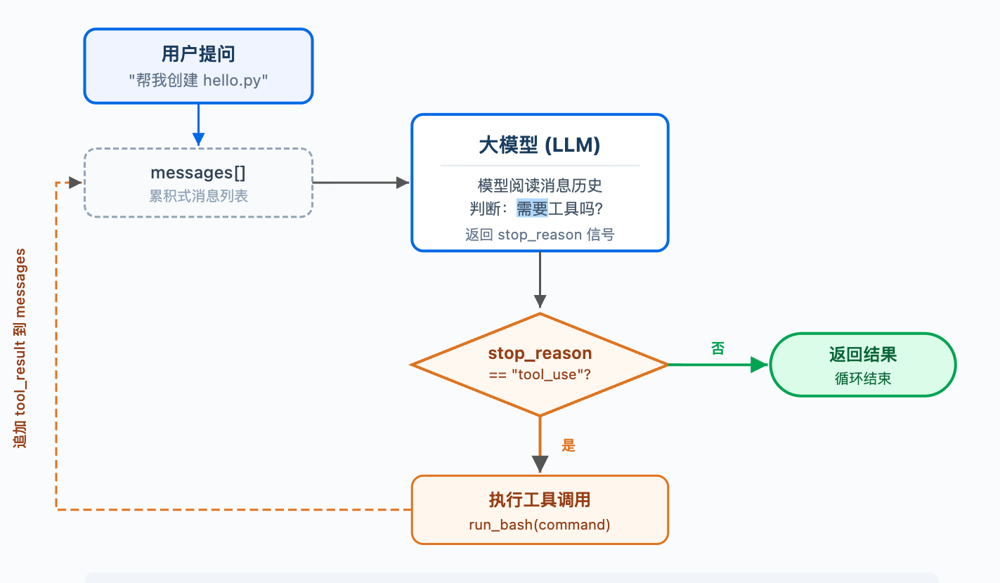
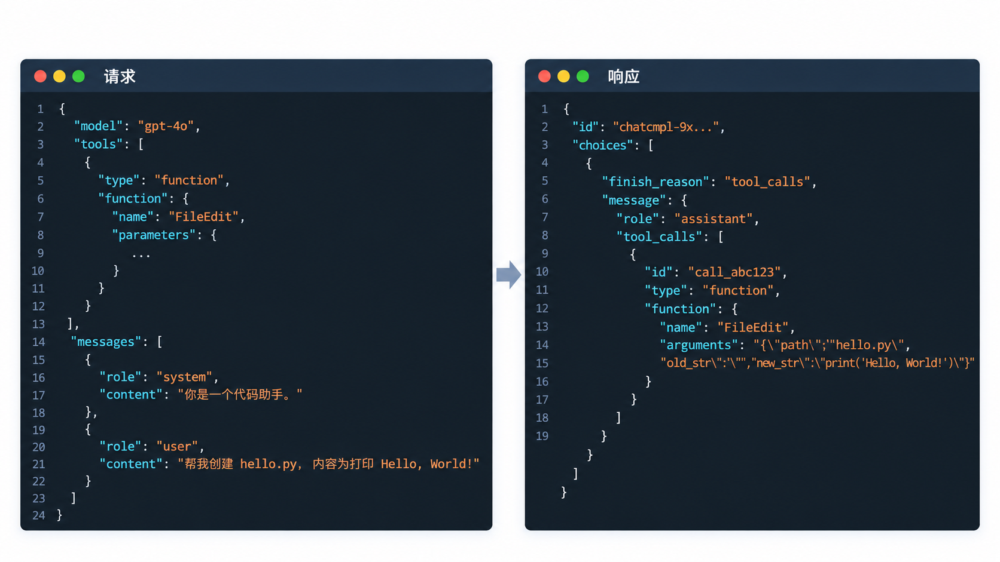
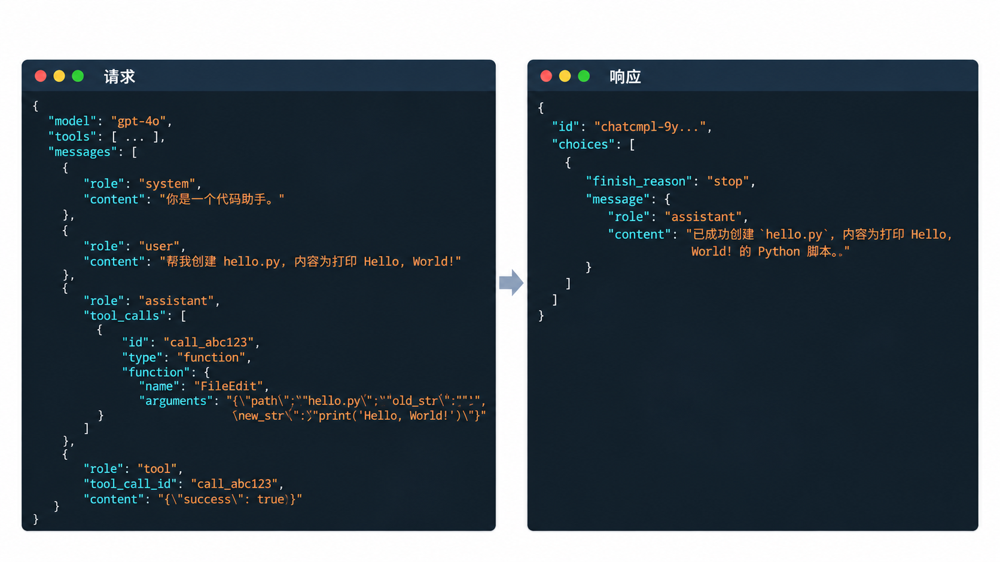
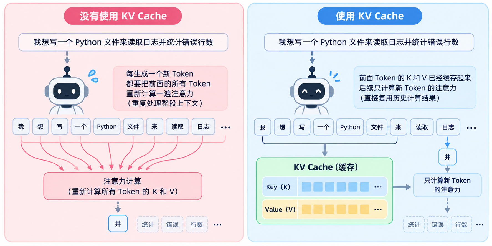
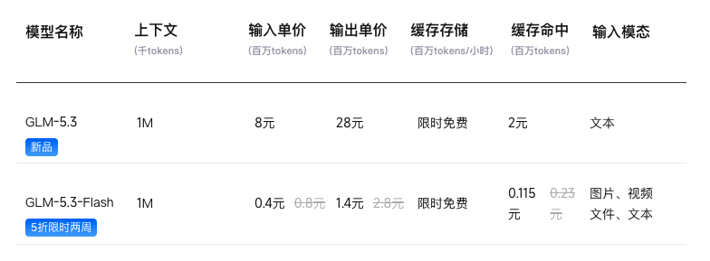
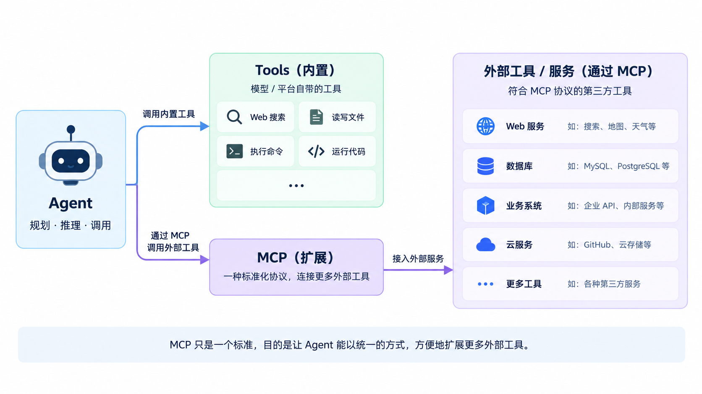
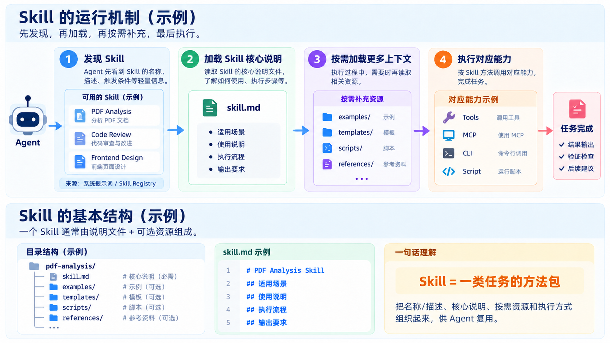
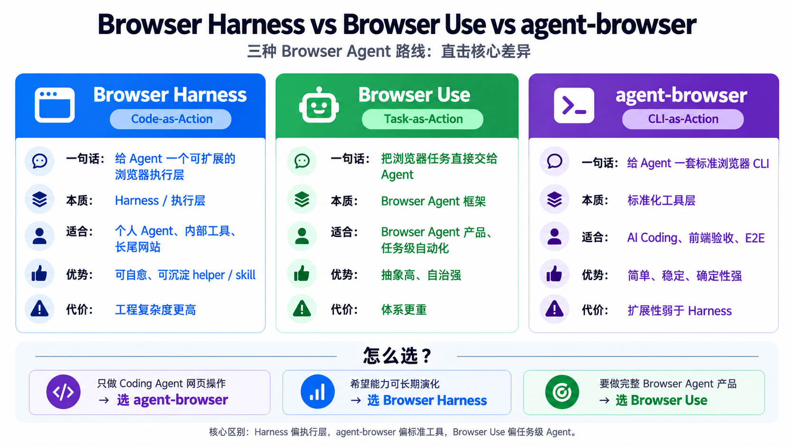
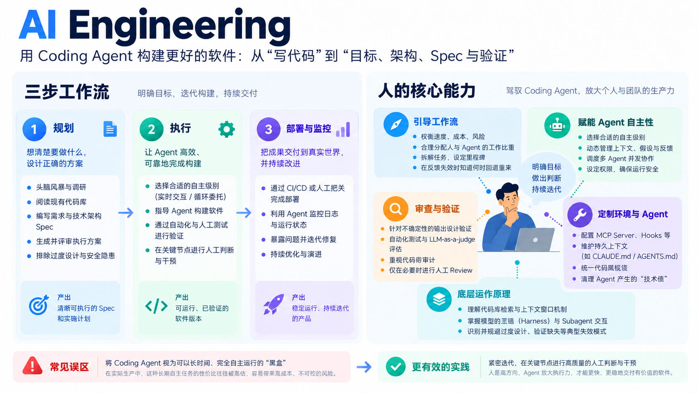

# AI Coding：从原理到实践

> 从 AI Coding 的发展历程出发，了解 Agent 的基本原理与运行机制，认识 Coding Agent 的工具链，并探索适合个人与团队的工作流实践。

## 内容概览

1. AI Coding 的发展与趋势
2. Agent 基本原理
3. AI Coding 工具链
4. AI Coding 工作流
5. 实践与思考

---

# 一、AI Coding 的发展与趋势

## 1.1 AI Coding 的发展

AI Coding 的演进，是 AI 逐步进入开发环境并接管更多执行环节的过程。下面的 0.0—3.0 是便于理解的能力分层，0.0 作为工程接入前的对照阶段，并非严格的发布时间排序。

- **0.0 时代：通用对话（Chat）**（2022.11—2023 年初）
  - **代表工具**：ChatGPT（Web）
  - **协作方式**：开发者在浏览器与终端间手动搬运代码和报错。

- **1.0 时代：代码补全（Completion）**（2021—2022 年底）
  - **代表工具**：GitHub Copilot（初代插件）、Tabnine
  - **协作方式**：AI 行内预测代码，开发者按 `Tab` 采纳。

- **2.0 时代：编程助手（Assistant）**（2023—2024 年底）
  - **代表工具**：GitHub Copilot Chat、早期 Cursor、早期 Cline
  - **协作方式**：AI 能理解项目，并同时修改多个相关文件。开发者负责检查和确认结果。

- **3.0 时代：Agent**（2025—至今）
  - **代表工具**：Claude Code、Cursor、Codex
  - **三种形态**：
    - **CLI**：Claude Code——以 CLI 为核心，以终端为主
    - **IDE**：Cursor——VS Code + Agent SDK，以代码编辑器为主
    - **Workbench**：Codex——Agent SDK + 对话页面，以对话和任务为主
  - **协作方式**：开发者给出目标，Agent 自主执行、测试和修复。

## 1.2 Next：Cloud & Multi-Agent

AI Coding 正从“人和 AI 同步协作”，走向“人定义目标，Agent 异步完成任务”。

- **Cloud Agent**：Codex Cloud、Cursor Cloud Agents、GitHub Copilot cloud agent 将 Agent 从本地带到云端，借助独立环境支持异步执行、长任务和 Issue/PR 驱动，开发者从实时协作转向目标管理。

- **Multi-Agent：单 Agent → 多 Agent 协作**
  - 多个不同品牌或不同角色的 Agent 并行执行、分工协作、统一编排。
  - **代表产品**：
    - **Grok Bot**：以多个持久化 Bot 组成 AI 团队，支持云端并行工作、共享上下文与任务交接。
    - **Multica**：开源的 Coding Agent 管理平台，接入不同品牌的 Agent，统一进行任务分派、运行监控与技能复用。
    - **Raft**：面向 Human + Agent 的协作平台，用频道、线程和任务连接不同 Agent，支持并行工作、任务交接与人工 Review。

- **趋势**：Agent 正变得更自主、运行时间更长，并逐步走向云端异步执行与多 Agent 协作。

## 1.3 模型发展趋势


### 总体趋势

- **Agent 化**：从单轮回答走向长时间、多步骤任务执行，能够规划、调用工具、验证并持续完成。
  *代表：GPT-6 Astra、Claude Fable 5.1*

- **能力与效率并行**：旗舰模型持续冲击能力上限，轻量模型则追求更低延迟、更低成本和更高并发。
  *效率路线：GPT-5.6 Luna、DeepSeek-V4-Flash*

- **环境交互原生化**：模型开始针对浏览器、桌面和专业软件环境专项训练，从“理解信息、调用 API”走向“理解界面、直接操作并完成任务”。
  *代表：GPT-6 Astra 的 Computer Use*
- **模型与 Harness 协同演进**：模型提升能力上限，Harness 从“弥补模型缺陷”逐步转向“组织和放大模型能力”。
  *模型原生能力增强后，Prompt、Skill 和规则会逐步去除历史补丁*
---

# 二、Agent 基本原理

## 2.1 概念

- Agent：可以理解为 LLM + Context + Tools + Loop，通过持续的“理解 → 决策 → 执行 → 观察”循环完成任务。
- Coding Agent：面向 SWE（Software Engineering） 场景的 Agent，通常具备文件读写、代码搜索、Shell、测试、Git 等工具。
- Harness：围绕模型搭建的运行框架，负责上下文组织、工具调用、状态管理、权限控制、测试验证和失败恢复。

关系可以简化为：

Model + Harness → Agent
Agent + SWE Environment → Coding Agent

> 通用 Agent 可进一步扩展 Web、Browser、Apps 等能力，而 Coding 正逐渐成为其重要的通用执行能力。

## 2.2 Agent Loop

Agent 的核心工作机制，可以概括为：LLM 基于上下文进行决策，通过工具调用与环境交互，并根据结果反馈循环执行，直到任务完成：



**一句话总结：** LLM 不断在“调用工具”和“返回结果”之间做决策，工具执行结果会成为下一轮推理的输入。

第一次请求

第二次请求


## 2.3 Context

### Context：模型本轮可见的输入

从 API 的视角看，Context 不是整个 JSON 请求，而是模型在这一轮实际能够使用的输入内容。以 Chat Completions API 为例，主要包括：

- **`messages`**：系统指令、用户需求、历史回复和工具结果
- **`tools`**：模型可调用的工具描述和参数 Schema
- **其他输入**：消息中的图片、文件等多模态内容

在 Coding Agent 中，代码、文件和终端输出不会自动进入 Context。Agent 会先读取或执行，再把需要的内容写入 `messages` 或工具消息中。

**Context Window** 是模型一次请求能够容纳的最大 Token 容量，具体上限由模型和接口决定。Context 接近上限时，Agent 通常会在下一次请求前压缩或重建 `messages`。

### KV Cache




KV Cache 是模型对已经处理过的 Context 前缀进行的内部计算缓存，用于减少重复计算、提升响应速度。对 Agent 设计的实践启发主要有两点：

1. **固定前缀不变**：需要切换 System Prompt、工具或规则时，新开对话。
2. **合理选择会话**：目标相关就继续，目标变化就新开。

## 2.4 MCP 与 Skills

### MCP

MCP（Model Context Protocol）是一种连接 Agent 与外部工具、数据源的开放协议，让 Agent 可以用统一方式发现和调用外部能力。



MCP 按部署方式主要分为两类：

- **本地 MCP**：运行在本机，通过本地进程与 Agent 通信
- **远程 MCP**：运行在服务器，通过网络与 Agent 通信

### Skills：面向任务的能力封装

Skill 是把专家经验、工作流、品味与工具使用方式，封装成可发现、可分发、可复用、可迭代的 Agent 能力单元。

- **可复用 / 可分发**：像 Agent 的能力包，可安装、共享、跨任务复用。
- **渐进式披露**：先发现、后加载、按需读取，减少 Context 占用。
- **模块化 / 可组合**：小 Skill 可以组合成更复杂的 Agent 能力。
- **经验可执行化**：把专家经验、SOP、品味、工具使用方式沉淀成 Agent 可执行的方法。
- **可迭代 / 可评测**：Skill 可以独立升级和验证，无需重新训练模型。
  

---

# 三、AI Coding 工具链

## 开发环境准备

### PowerShell 7

https://github.com/powershell/powershell
Windows 下更现代的 Shell，适合日常开发、脚本编写和 CLI Agent 使用。

### Windows Terminal

https://github.com/microsoft/terminal
统一的终端入口，支持多标签和分屏，适合同时管理多个 CLI 或 Agent 会话。

### Node.js 22+

许多 AI Coding CLI、MCP Server 以及 npm / npx 工具都依赖 Node.js。

### Python 3+

自动化、数据处理和脚本工具常见的运行环境。

### Git

基础开发环境，用于版本控制、分支管理和变更追踪。

### WSL（可选）

提供更完整的 Linux 环境。如果经常使用 Linux Shell、Docker 或部分 MCP 工具，WSL 可以减少兼容性问题。

### 推荐组合

> Windows Terminal + PowerShell 7 + Node.js 22+ + Python 3+，WSL 按需安装。

## Agent 软件

- **CLI**：Claude Code、OpenCode、OpenCode 2、Pi Coding Agent、OMP（oh-my-pi）、Codex CLI
- **IDE**：Cursor、Qoder、CodeBuddy、Trae
- **App**：Codex、WorkBuddy、Qoder Work、Trae Work

## Agent 配置与目录结构

以 Claude Code 为例，配置主要分为**用户级**与**项目级**：前者用于个人跨项目复用，后者用于当前项目与团队协作。

```text
~/.claude/                         # 用户级目录
├── CLAUDE.md                      # 个人通用指令
├── settings.json                  # 个人设置：权限、Hooks 等
└── skills/<name>/SKILL.md          # 个人 Skills

项目根目录/
├── CLAUDE.md                      # 项目背景、开发约定、常用命令
├── .mcp.json                      # 项目共享的 MCP 配置
└── .claude/
    ├── settings.json              # 项目共享设置
    ├── settings.local.json        # 当前项目的个人设置
    ├── rules/*.md                 # 按主题或文件路径组织的规则
    ├── skills/<name>/SKILL.md      # 项目 Skills
    └── agents/*.md                # 自定义子 Agent
```

`~` 表示用户主目录：macOS / Linux 通常是 `/Users/用户名` 或 `/home/用户名`，Windows 对应 `%USERPROFILE%`，例如 `C:\Users\用户名`。以上为默认位置与常用文件，按需创建即可。

- **指令与规则**：`CLAUDE.md` 提供持续使用的上下文和约定；`rules/` 可拆分规则，并按文件路径限定加载范围。
- **设置与能力**：`settings.json` 配置运行行为；MCP 接入工具；Skills 根据任务需要加载，也可手动调用。
- **系统提示词**：由工具内置并组织；`CLAUDE.md` 和 Rules 是用户补充的指令，不等同于完整的系统提示词，也不能代替权限控制。

参考：[Claude Code 官方目录说明](https://code.claude.com/docs/en/claude-directory)、[配置说明](https://code.claude.com/docs/en/settings)。

## CC Switch：统一管理 Agent 配置

项目地址：[GitHub](https://github.com/farion1231/cc-switch)

### 解决的问题

不同 Coding Agent 的 Provider、Model、API Key 和 Base URL 配置通常彼此分散，切换和维护成本较高。

### 主要能力

- 统一管理 Claude Code、Codex、OpenCode 等工具
- 快速切换 Provider 和 Model
- 提供 API Proxy，统一转发模型请求
- 管理 MCP 与 Skills 配置
- 减少手动修改 JSON、TOML 和环境变量的操作

### 工具定位

> CC Switch 是 Coding Agent 的配置管理、切换与 API 代理工具。

```text
Coding Agent → CC Switch（配置切换 / API Proxy）→ Provider / Model
```

## 常见 API 格式

不同模型和 Provider 常见的接口格式包括：

- **OpenAI Chat Completions**（`POST /v1/chat/completions`）：经典的 `messages` 对话格式，每轮请求携带全量消息历史。
- **Anthropic Messages**（`POST /v1/messages`）：Claude Code 使用的消息式接口，每轮请求携带全量消息历史，工具调用采用 Anthropic 的内容块格式。
- **OpenAI Responses**（`POST /v1/responses`）：Codex 使用的接口格式，通过 `previous_response_id` 关联上一轮响应，支持只传递新的输入和工具结果，无需客户端重复发送完整历史。

## 9Router：统一模型网关

### 解决的问题

不同 Coding Agent、模型和供应商之间的 API 格式与接入方式并不统一。

### 主要能力

- 提供统一 API 入口
- 支持多 Provider / Model 路由
- 支持 Failover
- 管理配额与用量
- 进行 API 协议适配

### 工具定位

> 9Router 是位于 Coding Agent 与模型之间的 AI Gateway / Router。

## Web Search 与 Web Fetch

### Tavily（[官网](https://www.tavily.com/)）：偏 Search / Research

- Web Search、Extract、Crawl、Research
- 适合资料搜索、文档查询和技术调研
- 支持 MCP，也可以通过 CLI + Skills 接入

### Firecrawl（[官网](https://www.firecrawl.dev/)）：偏 Fetch / Crawl

- Search、Scrape、Crawl、Extract
- 擅长将网页转换为干净、结构化的内容
- 支持动态网页和批量抓取
- 支持 MCP，也可以通过 CLI + Skills 接入

### 接入方式

- **MCP**：直接作为 Agent 的 Tools 使用
- **CLI + Skills**：Agent 通过命令行调用，Skill 负责说明使用方法和流程

### 实践组合

> 在内网或受限环境中，可以使用 Tavily + Firecrawl 构建 Web Search / Web Fetch 能力。

## 浏览器自动化

浏览器自动化让 Agent 能够访问网页、操作页面并验证结果，底层通常基于 Chrome DevTools Protocol（CDP）、Playwright，再通过 CLI、Skill 或 Agent 框架接入。

**MCP 工具**

- **[Chrome DevTools MCP](https://github.com/ChromeDevTools/chrome-devtools-mcp)**：面向开发调试，提供 Console、Network、Performance 和页面检查能力。
- **[Playwright MCP](https://github.com/microsoft/playwright-mcp)**：面向浏览器自动化，提供页面访问、点击、输入和 UI 测试能力。

**Agent 浏览器工具与框架**



这些工具通过 CLI、MCP 或 Skill 暴露给 Agent，分别承担浏览器调试、页面自动化和任务执行等职责。

## skills

### Skill Manager

[Skills Manager](https://github.com/xingkongliang/skills-manager) 是一个跨平台的桌面 Skill 管理工具，提供统一 Skill 库、跨 Agent 部署、Preset 管理、版本更新和 Git 备份同步，支持 50+ 个 AI Coding 工具。

skills.sh 是开放的 Agent Skills 目录与排行榜，可以用于：

- 搜索和发现社区 Skills
- 查看 Trending、Hot、Official 等分类
- 安装可复用的任务能力

```bash
npx skills add <owner/repo>
```

## Agent 会话管理

### [Herdr](https://github.com/herdrdev/herdr)

Herdr 是面向 AI Coding Agent 的终端工作区管理器。它通过后台 Session Server 持有真实终端进程，并提供 Workspace、Tab 和 Pane 等组织方式。

- **持久化 Session**：关闭终端、断开 SSH 后，Agent、Shell、测试和服务仍可继续运行。
- **Agent 状态识别**：显示 Agent 的 `working`、`blocked`、`done` 和 `idle` 状态。
- **多 Workspace**：在不同项目或任务中分别管理 Claude Code、Codex、Cursor、OpenCode 等终端会话。
- **远程与自动化**：支持 SSH 连接，并提供 CLI 和 Socket API，便于脚本或其他 Agent 操作会话。
- **多 Agent 协作**：多个 Agent 可在不同 Pane 中并行运行，统一查看状态并切换会话。

### [Orca](https://github.com/stablyai/orca)

Orca 是面向并行 Coding Agent 的 ADE（Agent Development Environment），将多个 Agent、Git Worktree、终端、浏览器和代码审查集中到一个工作台中。

- **并行 Worktree**：为不同 Agent 创建隔离的 Git Worktree，并行执行同一个任务，再比较和合并结果。
- **Agent 工作台**：统一管理 Codex、Claude Code、OpenCode、Pi 等终端 Agent。
- **浏览器与设计模式**：通过浏览器选择页面元素，将对应的 HTML、CSS 和截图发送给 Agent。
- **远程与移动协作**：支持 SSH Worktree，并可通过移动端查看状态、接收通知和继续交互。
- **工程协作**：支持 Diff 标注、文件拖拽、GitHub / Linear 集成，以及用于自动化的 Orca CLI。

---

# 四、AI Coding 工作流

## 4.1 AI Coding 通用工作流



## 4.2 Agent 开发工作流

### SDD：Spec-Driven Development

SDD（规范驱动开发）是先用结构化 Spec 明确需求、约束和验收标准，再让 Agent 按 Spec 设计、实现和验证；代码是 Spec 的实现结果，Spec 也是后续 Review 和协作的依据。

### OpenSpec 与 Superpowers

两者都可以独立完成同一个需求，但侧重点不同：

- **[OpenSpec](https://github.com/Fission-AI/OpenSpec)（设计与变更契约）**
  - **流程**：`propose（提出变更） → review / update（评审修改） → apply（实现） → archive（归档）`
  - **侧重点**：明确改什么、为什么改、边界和验收标准，并将变更沉淀为结构化记录。
- **[Superpowers](https://github.com/obra/superpowers)（执行纪律与技能流水线）**
  - **流程**：`brainstorming（头脑风暴） → plan（编写计划） → execute（执行） → review（审查） → finish（收尾）`
  - **侧重点**：规范 Agent 的执行过程，通过 Sub-Agent、TDD 和 Review 提升交付质量；Git Worktree 作为可选的隔离机制。

### mattpocock

> https://github.com/mattpocock/skills

```text
/grill-with-docs（头脑风暴）
    ↓
/to-spec（生成 Spec）
    ↓
/to-tickets（拆分任务）
    ↓
/implement（实现）
    ↓
/code-review（代码审查）
```

**grilling/grill-me的核心：

- **苏格拉底式提问**：Agent 提问并给出建议，用户作出决定。
- **设计树分轮推进**：按决策依赖逐轮展开，回答一层再进入下一层。
- **达成共识后再行动**：Agent 查代码，用户做决策，确认后再进入 Spec 和实现。


## 4.3 AI 开发工作流的趋势

AI 开发工作流正从显式、固定的流程，转向 Agent / Harness 内置的、按任务复杂度自适应的执行机制。外部工具不会消失，但会逐渐变成可插拔的 Skill、规则和评测层。

## 4.4 AI Coding 工程化范式

- **Prompt Engineering**：通过 Prompt等方式，把需求说清楚，让模型按预期回答。
- **Context Engineering**：让 Agent 看到完成任务所需的信息。
- **Harness Engineering**：为 Agent 提供执行环境，让它能调用工具、运行代码并获得反馈。
- **Loop Engineering**：让 Agent 自动执行、验证和修正，直到完成或停止。
- **Graph Engineering**：让多个运行各自 Loop 的 Agent，按职责、任务依赖和交接关系协作，并根据执行情况动态调整任务图。

---

# 五、实践与思考

## 如何写一个 Skill

1. **选择真实任务**：从重复工作中选择一个需求，先让 Agent 完成任务，得到满意的结果。
2. **整理执行经验**：记录可复用的步骤、所需资料和工具，以及执行中需要反复提醒的要求。
3. **编写 Skill**：写清操作步骤，将固定操作整理成脚本，附上模板或示例，并明确结果检查和错误修复方法。
4. **测试效果**：使用不同任务和模型测试，检查结果是否达标，找出容易失败的环节。
5. **持续改进**：根据实际使用和分享后的反馈修改，优先解决共性问题，避免堆叠特殊需求。

## 思考

- **开发者的角色与工作重心变化**：以前更多是自己掌勺炒菜，现在更像负责整个厨房的主厨：决定做什么、准备好厨房、安排分工，最后把关出菜质量。Agent 承担更多执行工作，人仍然需要懂技术、能判断方案，并对交付负责。
- **需求澄清与对齐**：开火之前，要先弄清楚给谁吃、有什么忌口、预算多少。做开发也是一样：先和 Agent 把目标、范围、约束和验收标准说清楚，不确定的地方通过提问、读代码和讨论逐步对齐。
- **搭建验证环境**：让 Agent 能自己运行、测试和修正，形成验证闭环。人从“验证者”退为“审阅者”，重点审阅变更与验证结果，把关交付质量。

---

## 参考大纲

[FlowUs 大纲](https://flowus.cn/d7f002f0-f800-41a7-9803-fa12187417ca)
