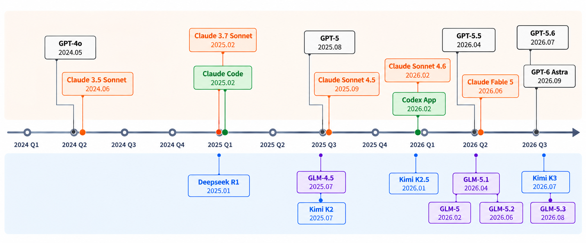

# AI Coding：从原理到实践

从模型趋势与 Agent 原理出发，认识 Coding Agent 工具链，了解工作流与工程实践。

AI Coding 正逐步改变开发者与工具的协作方式。理解模型如何决策、Agent 如何执行，以及人如何组织和验证任务，是将这些能力用到实际项目中的基础。

## 内容概览

1. AI Coding 的发展与趋势
2. Agent 基本原理
3. AI Coding 工具链
4. AI Coding 工作流
5. 思考

## 一、AI Coding 的发展与趋势

理解 AI Coding 的变化，可以先看开发者把哪些工作交给了 AI：从补全几行代码，到修改多个文件，再到执行完整任务。随着执行范围扩大，开发者需要投入更多精力来明确目标和检查结果。

### AI Coding 的发展

| 阶段 | 时间 | 代表工具 | 协作方式 |
| --- | --- | --- | --- |
| 1.0：代码补全 | 2021—2022 年底 | GitHub Copilot 初代插件、Tabnine | AI 行内预测代码，开发者按 Tab 采纳。 |
| 2.0：编程助手 | 2023—2024 年底 | GitHub Copilot Chat、早期 Cursor、早期 Cline | AI 理解项目并修改多个相关文件，开发者检查和确认结果。 |
| 3.0：Agent | 2025—至今 | Claude Code、Cursor、Codex | 开发者给出目标，Agent 自主执行、测试和修复。 |

CLI、IDE、Workbench 是三种产品形态，不代表能力等级。

### Cloud Agent 与 Multi-Agent

#### Cloud Agent

Agent 从本地走向云端，在独立环境中执行长任务；开发者从实时协作转向目标管理。

- **Codex Cloud**：云端独立环境，支持异步执行与长任务。

- **Cursor Cloud Agents**：把本地编辑转向云端任务执行。

- **GitHub Copilot cloud agent**：由 Issue 驱动执行，并回到 PR 协作。

#### Multi-Agent

多个不同品牌或不同角色的 Agent 并行执行、分工协作、统一编排。

- **Grok Bot**：持久化 Bot 组成团队，支持云端并行与任务交接。

- **Multica**：接入不同品牌 Agent，统一分派与运行监控。

- **Raft**：连接 Human 与 Agent，支持并行工作与人工 Review。

- **趋势**：Agent 正变得更自主、运行时间更长，并逐步走向云端异步执行与多 Agent 协作。

### 模型发展趋势

模型能力的迭代与 Agent 产品的发展相互推动。时间线可以直观看出模型版本、Agent 产品和开源模型的演进节奏：



模型能力与 Agent 产品同步演进。理解 AI Coding，需要同时关注模型与运行框架的发展。

### 主流模型

| 分类 | 关注点 | 模型 |
| --- | --- | --- |
| 顶级模型 | 能力上限 | GPT-6 Astra、Claude Fable 5.1、Claude Fable 5、Claude Opus 5、GPT-5.6 Sol |
| 强模型 | 综合能力 | Kimi K3、GLM-5.3、Qwen3.8 Max、Grok 4.6、~~DeepSeek V4 Pro~~ |
| 高效模型 | 速度与成本 | Gemini 3.8 Flash、GLM-5.3-Flash、GPT-5.6 Luna、Qwen3.8-Flash-Next、DeepSeek V4 Flash |

### 模型趋势解读

这些变化可以从几个方向理解：

- **Agent 化**：从单轮回答走向长时间、多步骤任务执行，能够规划、调用工具、验证并持续完成。GPT-6 Astra、Claude Fable 5.1 是本文关注的代表。
- **能力与效率并行**：旗舰模型追求更高能力上限，轻量模型关注延迟、成本和并发。GPT-5.6 Luna、DeepSeek V4 Flash 对应后一个方向。
- **环境交互原生化**：模型开始针对浏览器、桌面和专业软件环境训练，逐步具备理解界面、操作和验证结果的能力。
- **模型与 Harness 协同演进**：模型提升能力上限，Harness 组织执行过程。随着模型能力变化，已有 Prompt、Skill 和规则中的补丁也需要重新评估。
- **模型参与研发**：模型可以参与代码、实验和分析工作。讨论递归自我改进（RSI）时，还需要区分“辅助研发”与“自主完成研发闭环”这两种不同程度的能力。

## 二、Agent 基本原理

### Agent 的基本概念

可以用一个简化关系理解 Agent：**Agent = Model + Harness**。

Model 根据当前上下文进行推理，决定回复什么或调用什么工具。Harness 是模型之外的运行框架，负责组织上下文、提供工具接口、执行操作、管理状态，以及实施约束、验证和纠正。

Coding Agent 面向 SWE（Software Engineering，软件工程）场景，通常具备文件读写、代码搜索、Shell、测试和 Git 等工具。它通过这些工具接触项目，在执行后获得反馈，再决定下一步。

同样的机制也可以用于网页、浏览器和其他应用。只要具备合适的工具和执行环境，Agent 就可以把代码与自动化作为完成不同任务的手段。

### Agent Loop

一次任务通常需要多轮模型请求。以“帮我创建 hello.py”为例：

1. 用户需求进入消息列表 `messages[]`。
2. Harness 把消息历史和工具定义发送给模型。
3. 模型判断是否需要工具；需要时返回工具名称和参数。
4. Harness 执行工具，例如 `Edit(path, content)`。
5. 工具结果追加到消息列表，再次请求模型。
6. 模型根据更新后的上下文继续执行，直到返回最终结果或触发停止条件。

在这个 Chat Completions 示例中，`finish_reason == "tool_calls"` 表示模型返回了工具调用。Harness 执行后把工具结果写回上下文。模型正常结束生成后，Harness 还需结合任务状态决定是否结束任务。

模型负责决定调用什么工具，工具的实际执行由 Harness 完成，执行结果成为下一轮推理的输入。

#### 第一次请求：模型提出工具调用

发给模型：

```json
{
  "model": "glm-5.2",
  "messages": [
    {
      "role": "user",
      "content": "创建 hello.py，打印 Hello, World!"
    }
  ],
  "tools": [
    {
      "type": "function",
      "function": {
        "name": "Edit",
        "parameters": {
          "type": "object",
          "required": [
            "path",
            "content"
          ],
          "properties": {
            "path": {
              "type": "string"
            },
            "content": {
              "type": "string"
            }
          }
        }
      }
    }
  ]
}
```

模型返回：

```json
{
  "model": "glm-5.2",
  "choices": [
    {
      "finish_reason": "tool_calls",
      "message": {
        "role": "assistant",
        "content": null,
        "tool_calls": [
          {
            "id": "call_abc123",
            "type": "function",
            "function": {
              "name": "Edit",
              "arguments": "{\"path\":\"hello.py\",\"content\":\"print('Hello, World!')\"}"
            }
          }
        ]
      }
    }
  ]
}
```

模型返回 `tool_calls`，要求 Harness 执行 `Edit`。这里的 `arguments` 是 JSON 字符串，Harness 解析参数后才会真正写入文件。示例中的 `Edit` 是自定义工具名称。

#### 第二次请求：模型读取执行结果

再次发给模型：

```json
{
  "model": "glm-5.2",
  "messages": [
    {
      "role": "user",
      "content": "创建 hello.py，打印 Hello, World!"
    },
    {
      "role": "assistant",
      "content": null,
      "tool_calls": [
        {
          "id": "call_abc123",
          "type": "function",
          "function": {
            "name": "Edit",
            "arguments": "{\"path\":\"hello.py\",\"content\":\"print('Hello, World!')\"}"
          }
        }
      ]
    },
    {
      "role": "tool",
      "tool_call_id": "call_abc123",
      "content": "{\"success\":true,\"path\":\"hello.py\"}"
    }
  ],
  "tools": [
    {
      "type": "function",
      "function": {
        "name": "Edit",
        "parameters": {
          "type": "object",
          "required": [
            "path",
            "content"
          ],
          "properties": {
            "path": {
              "type": "string"
            },
            "content": {
              "type": "string"
            }
          }
        }
      }
    }
  ]
}
```

模型最终返回：

```json
{
  "model": "glm-5.2",
  "choices": [
    {
      "finish_reason": "stop",
      "message": {
        "role": "assistant",
        "content": "已创建 hello.py，文件内容为：\nprint('Hello, World!')"
      }
    }
  ]
}
```

Harness 把工具结果作为 `role: tool` 追加到消息列表，使用 `tool_call_id` 对应前面的调用。模型读取结果后返回最终回答；如果工具失败，也可以把错误信息传回模型，让它决定如何修正。

### Agent 核心构成

围绕 Agent Loop，五类模块共同支撑任务运行。

| 模块 | 职责 |
| --- | --- |
| Context | 组织当前任务所需的上下文信息。 |
| State / Session | 维护任务进度与会话状态。 |
| Tool System | 连接并调用外部能力。 |
| Execution Environment | 提供文件、终端、浏览器等实际操作环境。 |
| Permission / Guardrails | 控制权限、边界与安全约束。 |

Loop 读取上下文、调用工具、在环境中执行，并将结果与进度写回状态；权限约束贯穿执行过程。

### MCP

MCP（Model Context Protocol）是一种连接 AI 应用与外部能力的开放协议。这里主要关注工具调用：Agent 可以通过 MCP 发现服务提供的工具，并提交参数获得结果。协议也支持资源和提示模板，具体由服务端提供、客户端接入。参见 [MCP 服务端概念](https://modelcontextprotocol.io/docs/learn/server-concepts)。

按部署方式，可以区分为：

- **本地 MCP**：运行在本机，通常通过本地进程与 Agent 通信。
- **远程 MCP**：运行在服务器，通过网络与 Agent 通信。

Agent 可以直接调用内置的搜索、文件、终端和代码工具，也可以通过 MCP 连接网站、数据库、业务系统和云服务。MCP 负责连接，任务如何推进仍由 Agent 的运行流程决定。

### Skills

Skill 把一类任务的方法封装成 Agent 可复用的能力单元。

它的价值主要体现在以下方面：

- **可复用与可分发**：一份 Skill 可以安装、共享，并跨任务复用。
- **渐进式披露**：先发现，后加载，按需读取。
- **模块化与可组合**：小 Skill 可以组合成更复杂的能力。
- **经验可执行化**：把标准操作流程（SOP）和工具用法沉淀成方法。
- **可迭代与可评测**：可以独立升级和验证，无需重新训练模型。

Agent 使用 Skill 通常经历四个步骤：

1. **发现 Skill**：先看到名称、描述和触发条件。
2. **加载核心说明**：读取 `SKILL.md`，了解使用方法和执行步骤。
3. **按需加载资源**：需要时读取 `examples/`、`templates/`、`scripts/`、`references/` 中的示例、模板、脚本和参考资料。
4. **执行对应能力**：调用 Tools、MCP、CLI 或脚本完成任务。

这四步体现了渐进式披露：先发现适用能力，再加载说明和任务所需资源。

### Context

Context 是模型本轮实际可使用的输入，可从以下几部分理解：

- **Instructions**：系统指令、开发者指令，以及已加载的 Skill 指令。
- **Messages**：用户输入、模型回复、工具调用和工具结果。
- **Tools**：当前可调用的工具描述与参数 Schema，包括 MCP 提供的工具。

这是对内容的分类，各种 API 的字段组织方式可能不同。

文件、代码和终端输出需要先由 Tool 读取、检索或执行，结果才会进入这次请求。

Context Window 是一次请求可容纳的 Token 上限。Token 是模型处理文本等输入的计量单位，不能简单等同于字数。随着会话变长，Harness 需要选择、清理或总结内容，让后续请求保留任务所需的信息。

压缩通常包括以下操作：

- **清理 Tool Result**：删除或截断终端日志、搜索结果、长代码等旧输出。
- **总结历史消息**：把较早的用户消息、Agent 回复和执行过程总结成 Summary。
- **保留近期上下文**：保留最近几轮 Messages 与当前任务状态。

### KV Cache：单次推理中的内部缓存

以“写一个 Python 文件读取日志并统计错误行数”为例，模型逐步生成内容时，可以通过 KV Cache 复用前面已经计算过的状态。

- **没有 KV Cache**：逐步生成时，需要重复计算已有前缀的状态。
- **使用 KV Cache**：将已处理 Token 的 Key 和 Value 缓存下来，后续生成复用历史状态，减少重复计算。

新 Token 仍需要与已有上下文进行注意力计算。缓存节省的是历史状态的重复计算，并不意味着后续生成不再依赖前面的内容。

### Prompt Cache：跨请求复用相同前缀

服务商匹配请求前缀，命中后直接复用已计算结果，减少重复计算成本。

**缓存关系**：都复用不变前缀，减少重复计算。

KV Cache 从模型内部计算的角度描述单次推理中的缓存；Prompt Cache 从推理服务的角度描述多次请求间的前缀复用。

Prompt Cache 命中时，可复用已计算的前缀状态（通常就是 KV Cache）。

**实践启发**

- 系统提示词和工具定义保持固定。
- 用户输入、运行结果等动态信息追加到末尾。

以下历史计价示例说明普通输入与缓存命中输入的差别：

| 模型 | 普通输入 | 缓存命中输入 |
| --- | --- | --- |
| GLM-5.3 | 8 元 / 百万 Token | 2 元 / 百万 Token |
| GLM-5.3-Flash | 0.4 元 / 百万 Token | 0.115 元 / 百万 Token |

这些价格包含阶段性优惠，仅用于说明计价关系。缓存命中的输入可能采用更低计价，从而减少重复前缀的处理成本；实际价格以服务商公布的信息为准。

## 三、AI Coding 工具链

工具链可以按使用顺序来组织：准备开发环境，安装 Agent，接入模型，再按任务需要扩展网页、浏览器和会话管理能力。先让一个真实任务运行起来，再逐步补充工具，更容易判断每项配置是否有用。

### 本地开发环境

- **[Node.js 22+](https://nodejs.org/en)**：运行 JavaScript / TypeScript 工具，许多 Coding Agent、MCP Server 依赖它。

- **[Python 3+](https://www.python.org/)**：运行自动化脚本、数据处理与 Python 工具。

- **[PowerShell 7](https://github.com/PowerShell/PowerShell)**：Windows 原生 Shell，Agent 调用系统能力更直接。

- **[Windows Terminal](https://github.com/microsoft/terminal)**：统一承载 PowerShell、WSL 等会话，支持多标签和分屏。

- **[Git](https://git-scm.com/)**：Git Bash 提供类 Unix 命令行；Git 负责版本管理与代码协作。

- **[WSL](https://learn.microsoft.com/en-us/windows/wsl/) 可选**：在 Windows 中运行 Linux 用户空间，兼容 Bash 和 Linux 工具链，无需双系统。

### 主流 Agent

#### [Claude Code](https://code.claude.com/docs/en/overview)：成熟生态

推出较早，产品成熟度高，围绕 **Skills、Hooks、Subagent、MCP、Plugin** 等形成了完整的 Agent 能力与扩展生态。整体工具链和社区沉淀都比较成熟。

#### [Codex](https://github.com/openai/codex)：一体化工作台

从 CLI 延伸到 **Desktop 与 Cloud**，形成完整的一体化 Coding Agent 工作台；**Desktop 交互体验出色，Browser Use / Computer Use 实用，本地与云端任务衔接顺畅。**

#### [OpenCode](https://github.com/anomalyco/opencode)：开源通用

**完全开源、不绑定模型厂商**，可自由接入不同 Provider 和本地模型。整体配置自由度和可扩展性高，是通用型开源 Coding Agent 的代表。

#### [Pi](https://github.com/earendil-works/pi)：极简底座

刻意保持极简，默认核心只有 **read、write、edit、bash**，不预设复杂的 Agent 工作流；同时支持 **Extensions、Skills、Packages**，可在轻量底座上按需扩展。

#### [OMP](https://github.com/Raudbjorn/omp)：全能增强

基于 Pi 做了大量工程能力增强，内置 **LSP、Browser、Debugger、Subagent** 等能力，并提供 **Role 与模型路由**。相比 Pi 更强调高级能力开箱即用，同时保留较强的可配置性。

#### [DSH](https://github.com/deepseek-ai/deepseek-harness)：可组合架构

采用 **Everything is a Plugin** 的架构思路，Model、Tool、Skill、Agent Loop、Session、Sandbox、UI 等模块都可以独立替换和组合。采用 **本地 Host + Web** 的交互方式。

### CC Switch：配置切换与本地代理

[CC Switch](https://github.com/Hortus-Edenensis/cc-switch) 将多个 Coding Agent 的连接配置集中管理，方便在不同 Provider 和模型之间切换，同时提供本地代理能力。

- **配置管理**：维护多套 Provider、模型、API Key、Base URL 等配置，需要时切换。
- **MCP 与 Skills**：统一维护 MCP Server 和 Skills，方便在不同 Agent 间复用。
- **本地代理**：支持格式转换、热切换、故障切换和 Provider 健康监测。

配置切换决定 Agent 使用哪套连接信息，本地代理则参与请求转发。两者可以配合使用。

### 常见 API 格式

Provider 指提供模型服务的供应商。不同服务可能采用不同的 API 格式，常见形式如下：

| 接口 | 路径 | 消息组织方式 |
| --- | --- | --- |
| OpenAI Chat Completions | POST /v1/chat/completions | 通过 messages 显式传入本轮所需的消息历史。 |
| Anthropic Messages | POST /v1/messages | 使用消息与内容块组织输入，工具调用和工具结果也采用内容块形式。 |
| OpenAI Responses | POST /v1/responses | 支持显式传入上下文，也支持通过 previous_response_id 关联前一轮响应。 |

Responses 的关联机制支持按需只发送新的输入和工具结果，但并非所有请求都必须采用这种方式。无论使用哪一种接口，Agent 都需要让模型获得足够的任务上下文。

### 模型网关

模型网关位于 Agent 与模型服务之间，负责转发请求、适配格式和选择后端。模型接入数量增多后，可以把这些工作集中在网关中处理。

#### [9Router](https://github.com/decolua/9router)

- **多 Provider 接入**：通过 OAuth、API Key 等方式接入多个 Provider，OAuth Token 自动刷新。

- **模型组合与多模态**：按场景组合文本、图像、音频等模型，并设置多级 Fallback。

- **请求适配**：提供统一入口，转换 OpenAI、Claude、Gemini 等请求格式。

- **上下文优化**：RTK、Caveman 等。

其他模型网关各有侧重：

- **[CLIProxyAPI](https://github.com/router-for-me/CLIProxyAPI)**：把多个 CLI 账号代理成兼容多种协议的本地 API。
- **[New API](https://github.com/QuantumNous/new-api)**：面向平台化的模型聚合、渠道管理与用量计费。
- **[Sub2API](https://github.com/Wei-Shaw/sub2api)**：偏订阅额度分发、账号池管理与并发控制。

### WebSearch 和 WebFetch

搜索、网页提取和整站抓取经常出现在同一个任务中，因此不同产品的能力存在交叉。

- **[Tavily](https://www.tavily.com/)**：面向 AI Agent 的 Web 访问层，覆盖搜索、内容提取、站点 Map / Crawl 与 Research。
- **[Firecrawl](https://www.firecrawl.dev/)**：将搜索结果或网页转成 Markdown、JSON 等内容，并支持整站 Crawl。

其他产品还有 [Exa](https://exa.ai/)、[Brave](https://api.search.brave.com/app/documentation/web-search/get-started)、[TinyFish](https://www.tinyfish.ai/)。

接入 Agent 时，可以使用 MCP，也可以采用 Skill + CLI：MCP 提供工具调用接口，Skill 描述使用方法，CLI 承担具体执行。实际接入还要选择产品提供的对应组件。

### 浏览器自动化

需要操作页面、检查动态状态或验证交互结果时，可以使用浏览器自动化工具。

- **[Chrome DevTools MCP / CLI](https://github.com/ChromeDevTools/chrome-devtools-mcp)**：偏开发调试，使用 Console、Network、Performance 和页面检查能力。
- **[Playwright MCP / CLI](https://github.com/microsoft/playwright-mcp)**：偏浏览器自动化，执行页面访问、点击、输入和 UI 测试。

面向 Agent 的工具与框架又有不同侧重：

- **[Browser Harness](https://github.com/browser-use/browser-harness)**：可扩展的浏览器执行层，适合个人 Agent、内部工具和长尾网站，重点在于持续扩展浏览器能力。
- **[agent-browser](https://github.com/vercel-labs/agent-browser)**：标准化浏览器 CLI，适合 AI Coding 中的网页操作、前端验收和端到端测试（E2E）。
- **[Browser Use](https://github.com/browser-use/browser-use)**：任务级 Browser Agent 框架，适合构建完整的浏览器 Agent 产品与自动化任务。

### Skill 的安装和管理

从目录发现并安装 Skill，再统一维护不同 Agent 的能力配置。

#### [skills.sh](https://skills.sh/)

开放的 Agent Skills 目录与排行榜，用于发现和安装可复用的任务能力。

- 按 Trending、Hot、Official 等分类发现社区 Skills。
- 选定 Skill 后，用 Skills CLI 安装到指定 Agent。

[`npx skills add <owner/repo>`](https://www.skills.sh/docs/cli)

#### [Skills Manager](https://github.com/xingkongliang/skills-manager)

跨平台桌面管理工具，提供统一 Skill 库、跨 Agent 部署、Preset 管理、版本更新和 Git 备份同步。

- 统一管理不同来源的 Skills。
- 跨 Agent、跨项目部署，并保留版本和备份恢复路径。

### Agent 会话管理

长任务需要状态可观察、可交接、可恢复。

#### [Herdr](https://github.com/herdrdev/herdr)

让多个 Agent 同时工作，并且能够被观察、组织和协作。Herdr 通过后台 Session Server 持有真实终端进程。

- **Agent 状态感知：**：识别 working、blocked、done 和 idle 状态。
- **持久化 Session：**：关闭窗口或断开连接后，任务仍可继续运行。
- **多 Agent 工作区：**：用 Workspace、Tab 和 Pane 管理多个项目与多个 Agent。
- **Agent 协作：**：通过共享工作区、终端状态、脚本或 API 协调并行任务。

#### [Orca](https://github.com/stablyai/orca)

面向多 Agent 开发的桌面 IDE，将多个 Agent 与开发工具集中到一个工作台。

- **独立 Worktree：**：每个 Agent 使用独立 Git Worktree，便于并行开发、比较结果和合并代码。
- **内置浏览器：**：提供 Chromium 浏览器与 Design Mode，可将页面元素直接交给 Agent。
- **文件与终端：**：提供文件管理器、编辑器和终端分屏，减少工具切换。
- **代码审查：**：集成 Diff 查看、标注、提交和推送，方便从生成到交付。

## 四、AI Coding 工作流

工具准备好之后，还需要让 Agent 理解项目、复用经验，并按可检查的步骤完成工作。本章先组织目录和长期上下文，再讨论能力维护、Skill 编写和开发流程。

### Agent 配置目录结构

配置通常区分用户级和项目级：用户级用于跨项目复用，项目级用于当前仓库的约定和能力。以 Claude Code 的常用目录为例：

```text
用户级目录   ~/.claude/
├── CLAUDE.md
├── settings.json
├── skills/
└── agents/*.md

项目根目录   /repo
├── CLAUDE.md
├── CLAUDE.local.md
├── .mcp.json
└── .claude/
    ├── settings.json
    ├── settings.local.json
    ├── rules/*.md
    ├── skills/
    └── agents/*.md
```

部分 Agent 也会使用以下目录约定，具体支持范围以对应工具为准：

```text
用户级目录   ~/.agents/
└── skills/

项目级目录   repo/
├── AGENTS.md
└── .agents/
    └── skills/
```

指令与 Skills 可以复用：在 `AGENTS.md` 中写 `@CLAUDE.md` 来引用内容，`skills/` 直接使用软链接。引用语法是否会自动展开，需要结合目标 Agent 的支持情况确认。

目录中的文件分别承担不同职责：`CLAUDE.md` / `AGENTS.md` 保存指令与约定，`settings.json` 保存运行设置，`.mcp.json` 保存 MCP 配置，`rules/` 组织规则，`skills/` 存放 Skills，`agents/*.md` 定义子 Agent。带有 `local` 的文件用于项目中的个人配置。

### 全局/项目级长期上下文

#### CLAUDE.md / AGENTS.md

- **少而重要**：只保留每个 Session 都值得加载的信息，以 200 行以内为整理目标；这是一项写作建议，不是文件格式的硬限制。

- **写不可推断的信息**：记录项目架构、特殊约定、工具命令、历史包袱和踩坑点，不复述代码。

- **分层组织**：项目根目录的 CLAUDE.md 管项目整体，子目录 CLAUDE.md / Rules 管局部；用户级目录用于跨项目通用配置。

- **渐进披露**：复杂流程放进 Skill，按任务需要加载。

- **能强制的交给工具**：格式化、检查和禁止操作等确定性要求交给 Hooks / Permissions。

- **兼容性**：Claude Code 读取 `CLAUDE.md`；需要复用 `AGENTS.md` 时，可在 `CLAUDE.md` 首行写 `@AGENTS.md`，或直接建立软链接。

#### Rules

长期指令较多时，可以把前端、后端、测试等不同主题拆进 Rules。能够按路径限定的规则只在相关文件范围内生效，降低无关信息的干扰。

- **按主题拆分**：前端、后端、测试、安全等规则分开维护，避免一个 Rule 文件越来越大。
- **按路径生效**：能限定目录或文件类型的规则就限定范围，减少无关加载。
- **项目优先**：项目规则放项目内，全局只保留真正跨项目通用的规则。
- **持续治理**：定期清理重复、过时、冲突的 Rules，避免和 CLAUDE.md、Skills 互相打架。

### 能力扩展

#### Skills 管理

- **按需安装**：需要什么装什么，不做全量预装。
- **分层管理**：通用能力放全局，项目专属能力放项目内。
- **持续治理**：定期清理重复、过时、低使用的 Skill。

#### MCP 管理

- **分层配置**：区分项目级和全局级，**优先项目级**，避免污染所有项目。
- **尽量少用**：能用 Agent 原生能力、CLI、API 解决的，就不要额外挂 MCP。
- **控制数量**：减少重复和低价值 MCP，降低依赖、权限和稳定性成本。

此外，还可以按需要补充以下能力：

- **Hooks**：将格式化、Lint、检查和危险操作拦截等确定性动作交给脚本或规则执行。
- **LSP / Code Intelligence**：为大型代码库提供跳转、引用和类型诊断等代码智能，按语言和项目配置。
- **Subagents**：将搜索、Review、Research 等独立任务交给子 Agent，实现上下文隔离与并行执行。

### 如何写一个 Skill

Skill 适合从一次已经验证有效的任务中提炼。先跑通任务，再整理可重复的方法，能够避免写出只有原则、缺少具体执行步骤的说明。

例如，反复进行发布检查时，可以把“读取版本信息、运行检查、整理变更、输出待确认事项”整理成 Skill。描述中写清适用任务，正文给出执行步骤，固定操作放进脚本，结果格式使用模板。这样下一次遇到同类任务，就有可以直接复用和改进的方法。

- **选择真实任务**：从重复工作中选择一个需求，先让 Agent 完成任务，得到满意的结果。

- **整理执行经验**：记录可复用的步骤、所需资料和工具，以及执行中需要反复提醒的要求。

- **编写 Skill**：写清操作步骤，将固定操作整理成脚本，附上模板或示例，并明确结果检查和错误修复方法。

- **测试效果**：使用不同任务和模型测试，检查结果是否达标，找出容易失败的环节。

- **持续改进**：根据实际使用和分享后的反馈修改，优先解决共性问题，避免堆叠特殊需求。

### Superpowers 与 mattpocock

当任务包含多个阶段时，可以借助现成的工作流 Skills 组织需求、实现和审查。下面两组工具展示了不同的组织方式。

#### [Superpowers](https://github.com/obra/superpowers)

通过 Sub-Agent、TDD、Review 和可选的 Git Worktree，提高交付质量。

brainstorming：头脑风暴 **→** plan：编写计划 **→** execute：执行 **→** review：审查 **→** finish：收尾

#### [mattpocock/skills](https://github.com/mattpocock/skills)

用一组 Skills 把需求澄清、Spec、任务拆分、实现和审查串起来。

grill-with-docs：需求澄清 **→** to-spec：生成 Spec **→** to-tickets：拆分任务 **→** implement：实现 **→** code-review：代码审查

### SDD

SDD（Spec-Driven Development，规范驱动开发）：以规格说明为核心，先明确要构建什么，再让 Agent 根据规格完成设计、拆解和实现。

#### [OpenSpec](https://github.com/Fission-AI/OpenSpec)：设计与变更契约

轻量、流程清晰（propose → apply → sync/archive）；规范与代码同仓，持续维护当前系统行为的主规范。

propose：提出变更 **→** review / update：评审修改 **→** apply：开始实现 **→** archive：归档记录

#### [Spec Kit](https://github.com/github/spec-kit)：规范驱动流程

功能更强、扩展性更高，支持预设、扩展和工作流；但标准流程更复杂，规范归档需要额外组织。

Spec：明确需求 **→** Plan：制定方案 **→** Tasks：拆分任务 **→** Implement：开始实现

### AI 工程化

前面的实践可以从五个角度理解。这些概念关注的问题不同，不必把它们理解为严格的阶段或层级。

- **Prompt Engineering**：关注“怎么写好一条指令”。

- **Context Engineering**：关注“怎么给 AI 提供足够且精准的上下文”。

- **Harness Engineering**：关注“怎么构建一个系统性的框架来约束和驱动 AI”。

- **Loop Engineering**：关注“怎么让 Agent 持续执行、验证并在失败后自我修正”。

- **Graph Engineering**：关注“怎么把 Agent、工具和流程编排成可分支、可并行的协作网络”。

## 五、思考

### Agent 元能力：善于借助 Agent 解决问题

从善用搜索引擎、善用网页 Chat，到善用 Agent，解决问题的方式正在从“获取答案”走向“直接完成任务”。

- **先装一个能用的 Agent**：先有一个真正能干活的 Agent，后面的配置、扩展和使用才有基础。

- **用 Agent 武装 Agent**：环境配置、工具安装、能力接入，都可以让 Agent 参与解决；逐步补齐浏览器、终端、CLI、MCP、Skill 等“手、眼、脚”。

- **善用 Agent 解决陌生问题**：遇到不会的、没做过的、复杂的问题，也敢于先让 Agent 尝试，善于借助它探索方法、解决阻塞，不断扩展自己能解决的问题边界。

- **用 Agent 构建自己的工具**：把重复需求和个人工作方式做成 Skill、脚本、小工具、浏览器插件、客户端或自动化流程，让 Agent 不只是现成工具，也能帮你创造新的工具。

这些实践共同指向一种能力：借助 Agent 持续扩展自己能解决的问题范围，并将有效的方法保存下来反复使用。

### AI 编程中的思维方式

用成熟的思维框架，让问题更清晰、验证更可靠。

#### 第一性原理

先回到问题本身。从目标、事实和约束出发，确认问题是否真实存在、能否复现，再判断根因和解决方案，避免 Agent 一上来就执行，却在错误的问题上越走越远。

#### 对抗式审查

主动引入一个反方，让另一个 Agent 从独立视角寻找漏洞、反例、遗漏和失败场景。不是让多个 Agent 相互附和，而是通过交叉审查提高结论可信度。

#### 消融实验

拿掉一个变量，看结果是否变化。某条 Rule、某个 Skill、Tool 或 Prompt 到底有没有价值，不靠感觉判断；保持其他条件不变，删除后重新运行，用结果验证它是否真的有效。

#### 奥卡姆剃刀

优先选择最简单、能工作的方案。能用简单方案解决，就不要过早引入复杂架构；先完成最小可行闭环，再根据真实需求逐步演进，避免过度设计。

#### 不确定性显式化

让不确定性显式出现，要求 Agent 主动说明：哪些结论缺少证据、哪些场景尚未验证、哪些判断只是推测，把隐藏的不确定性变成下一步可以验证的问题。

好的思维框架，可以用很少的 Prompt，激活一整套分析、质疑与验证机制。

### 使用 Coding Agent：AI 工程能力

Coding Agent 正在改变软件开发中人的工作重心：从亲自实现代码，转向决定做什么、设计架构、定义 Spec、组织执行和验证结果。

一个完整任务通常包含以下环节：

- **Planning**：理解问题、设计架构、明确 Spec 与执行计划。

- **Execution**：Agent 构建、测试、验证和修复。

- **Deployment & Monitoring**：部署、监控、发现问题并持续迭代。

- **Feedback**：根据结果反馈调整计划与执行，进入下一轮闭环。

要把这些环节组织好，需要相应的工程能力：

- **工作流管理**：决定如何拆解、执行与迭代任务。

- **Agent 自主性**：控制 Agent 的自主程度、Context 与多 Agent 协作。

- **结果审查**：通过测试、Evals、Code Review 等验证输出。

- **Agent 与环境定制**：通过 Skills、MCP、Hooks、AGENTS.md 等增强能力。

- **Agent 基础原理**：理解 LLM、Harness、Context、Tools、Subagents 等机制。

高效使用 Coding Agent，不是单纯追求更高自主性，而是建立“**规划** → **执行** → **验证** → **反馈**”的工程闭环。

### AI 不是软件工程的银弹

只有能让软件生产率、可靠性和简洁性提升一个数量级的方法，才称得上“银弹”。

#### 软件工程的本质困难

软件工程中的困难涉及目标、业务和组织关系，不能仅靠提高代码生成速度解决。

- **目标与概念**：要解决什么、为什么解决，以及什么才算成功。

- **复杂性**：业务规则、状态、依赖和边界相互交织。

- **约束与一致性**：系统必须适配既有架构、规范、法规和组织约束。

- **变化与验证**：需求持续变化，正确性还要靠测试、运行反馈和长期维护确认。

#### AI 能解决 / 缓解的部分

AI 可以承接更多实现和迭代工作，主要体现在以下方面：

- **自主执行**：从任务描述出发，规划、编码、运行、调试并交付。

- **复杂度承接**：理解并修改大范围代码，把实现复杂性转交给 Code Agent。

- **流程压缩**：串联规划、开发、测试和文档，减少传统协作中的等待。

- **并行探索**：同时尝试多种方案，持续迭代，放大个人和小团队的执行规模。

人仍需负责目标与价值、架构取舍、组织共识和验收责任。AI 则承担更多复杂实现、重复执行、调试迭代与并行探索。

AI 放大了处理软件复杂性的能力，但没有让复杂性本身消失——所以它仍然不是软件工程的银弹。
